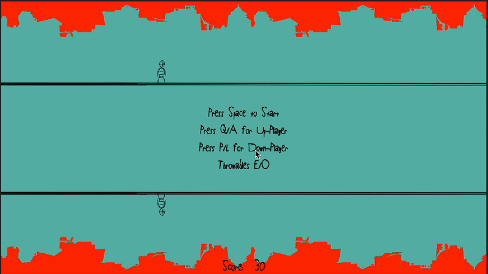

# Dual-Control Stickman Adventure

## Description
Guide two stickman characters through endless obstacles in this thrilling 2D dual-control game! Navigate the top and bottom lanes simultaneously while dodging hazards that increase in difficulty over time. Each impact triggers an immersive explosion, enhanced with dynamic Foley sound effects that bring the game to life. Designed with the "Small but Fun" theme, this challenge tests your reflexes and coordination in a compact, engaging experience.

## Controls
### Player 1 (Top Lane):
- **Q** - Move Up
- **A** - Move Down
- **E** - Throw a Heart (Obstacle)

### Player 2 (Bottom Lane):
- **P** - Move Up
- **L** - Move Down
- **O** - Throw a Heart (Obstacle)

## Features
- **Dual Control Mechanics**: Control two characters simultaneously.
- **Endless Challenge**: Increasing difficulty over time.
- **Dynamic Foley Sound Effects**: Impact sounds for immersive gameplay.
- **Fast-Paced Gameplay**: Reflex-based action.

## Installation
1. Clone the repository:
   ```sh
   git clone https://github.com/yourusername/dual-control-game.git
   ```
2. Open the project in Unity (Recommended version: 2022.3.55f1 or later).
3. Play the game in the Unity Editor or build for your preferred platform.

## Assets Used
- [Metroidvania Controller](https://assetstore.unity.com/packages/2d/characters/metroidvania-controller-1667)
- [2D Character Astronaut](https://assetstore.unity.com/packages/2d/characters/2d-character-astronaut-18265)
- [Pixabay Sound Effects](https://pixabay.com/sound-effects/)
- [Pizza Is My Favorite Font](https://www.1001fonts.com/pizza-is-my-favorite-font.html)

## Screenshots


## Contributing
Feel free to submit pull requests or report issues to improve the game!

## Play Now
Try the game on itch.io: [Stickman Dual Dash](https://rainbow-flamingo.itch.io/stickman-dual-dash)

## License
This project is open-source under the MIT License.

## Social Media
Share your progress using:
- #ScreenshotSaturday
- #WIPWednesday
- #IndieDevHour
